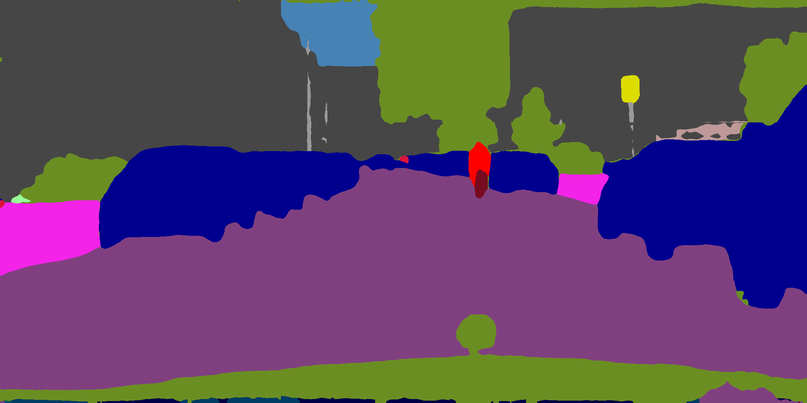

# PyTorch Knowledge distillation using Pspnet

### Introduction

This repository is a PyTorch implementation for Knowledge distillation. The code is modified from [PSPNet](https://github.com/hszhao/semseg.git). Sample experimented datasets is [Cityscapes](https://www.cityscapes-dataset.com).

### Usage

1. Highlight:

   - All initialization models, trained models and predictions are [available](https://drive.google.com/open?id=15wx9vOM0euyizq-M1uINgN0_wjVRf9J3).

2. Requirement:

   - PyTorch>=1.1.0, Python3, [tensorboardX](https://github.com/lanpa/tensorboardX), 

3. Clone the repository:

   ```shell
   git clone https://github.com/LiuZhenshun/Knowledge-Distillation.git
   ```

4. Train:

   - Download related datasets and symlink the paths to them as follows (you can alternatively modify the relevant paths specified in folder `config`):

     ```
     cd Knowledge Distillation
     mkdir -p dataset
     ln -s /path_to_cityscapes_dataset dataset/
     ```

   - Download initmodel/resnet50_v2 && exp/cityscapes/pspnet50  pre-trained [models]((https://drive.google.com/open?id=15wx9vOM0euyizq-M1uINgN0_wjVRf9J3)) and put them under folder `initmodel` for weight initialization. Remember to use the right dataset format detailed in [FAQ.md](https://github.com/hszhao/semseg/blob/master/FAQ.md).

   - Specify the gpu used in config then do training:


5. Visualization: [tensorboardX](https://github.com/lanpa/tensorboardX) incorporated for better visualization.

   ```shell
   tensorboard --logdir=exp/cityscapes
   ```

6. result:
   - Pspnet Result
      
   - Kowlege Distillation Result
      
